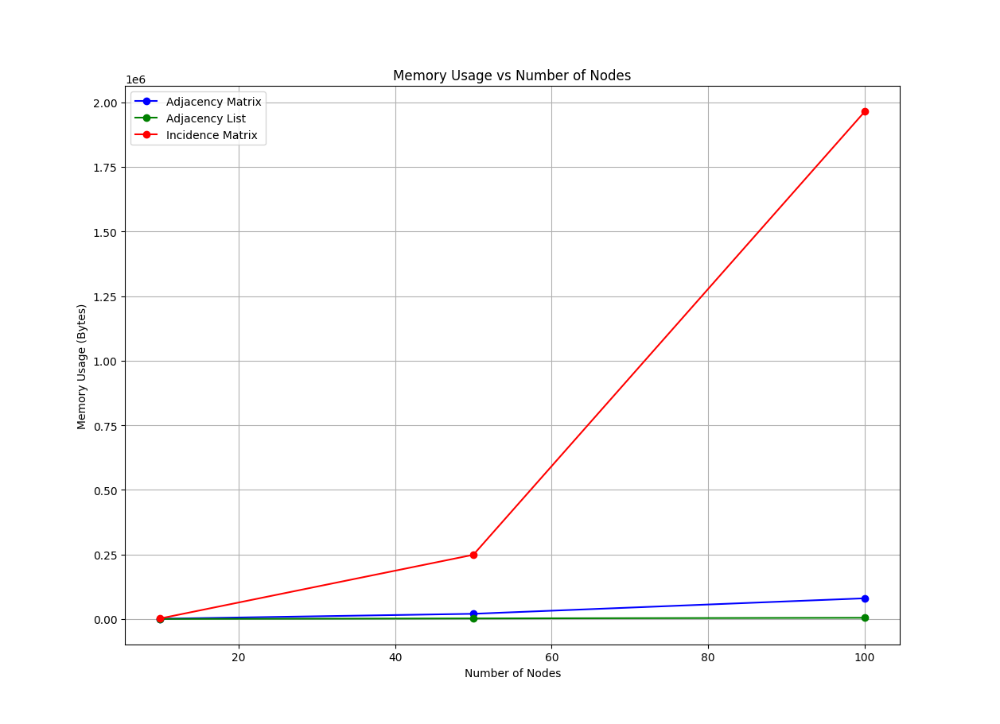

# A Comparative Study of Memory Usage in Graph Representations

## Introduction

Graph theory and network analysis are widely used across various fields such as computer science, biology, and sociology. When working with large networks, memory efficiency becomes a crucial factor. In this study, we investigate the memory consumption of three widely used graph representations:
- **Adjacency Matrix**
- **Adjacency List**
- **Incidence Matrix**

The goal is to understand how the memory requirements for each representation scale as the number of nodes increases. We conduct this analysis using random undirected graphs generated via the **Erdős–Rényi model**, where every edge has a fixed probability \(p = 0.5\) of being present.

## Graph Representations

### 1. Adjacency Matrix

An **Adjacency Matrix** \(A\) is a square matrix of size \(n \times n\), where \(n\) is the number of nodes in the graph. Each element \(A_{ij}\) is defined as follows:

\[
A_{ij} = 
\begin{cases} 
1, & \text{if there is an edge between node } i \text{ and node } j, \\
0, & \text{otherwise.}
\end{cases}
\]

The memory complexity of the adjacency matrix is \(O(n^2)\), making it inefficient for large, sparse graphs.

### 2. Adjacency List

An **Adjacency List** is a dictionary or list where each node is associated with a list of its neighboring nodes. For example, the adjacency list for a graph with three nodes and edges \((1, 2)\) and \((2, 3)\) would look like this:

\[
\{ 1: [2], 2: [1, 3], 3: [2] \}
\]

The memory complexity of the adjacency list is \(O(n + m)\), where \(m\) is the number of edges. This makes it more space-efficient for sparse graphs.

### 3. Incidence Matrix

An **Incidence Matrix** \(I\) is a matrix of size \(n \times m\), where \(n\) is the number of nodes and \(m\) is the number of edges. Each element \(I_{ij}\) is defined as:

\[
I_{ij} = 
\begin{cases} 
1, & \text{if node } i \text{ is incident to edge } j, \\
0, & \text{otherwise.}
\end{cases}
\]

The memory complexity of the incidence matrix is \(O(n \times m)\). While this representation can be efficient for certain types of graph algorithms, it becomes less efficient as the number of edges increases in dense graphs.

## Graph Generation: Erdős–Rényi Model

The **Erdős–Rényi model** is a probabilistic method used to generate random graphs. In this model, each pair of nodes has a fixed probability \(p\) of having an edge between them. For our experiment, we used \(p = 0.5\), meaning each pair of nodes has a 50% chance of being connected.

The model is defined as follows:
1. Let \(G(n, p)\) represent a random graph with \(n\) nodes and edge probability \(p\).
2. For each pair of nodes \(i\) and \(j\), an edge is added with probability \(p\), independent of other edges.

This model is particularly useful for understanding how graph properties (such as memory usage) scale with the number of nodes.

## Experiment Setup

### Objective

The objective of this experiment is to evaluate how the memory consumption of different graph representations scales as the number of nodes increases. The key research question is: _How does the choice of graph representation affect memory efficiency, particularly as graph size grows?_

### Methodology

1. **Graph Sizes**: We generated graphs with 10, 50, 100, and 500 nodes using the Erdős–Rényi model, with an edge probability \(p = 0.5\).
2. **Memory Measurement**: For each graph size, we computed the memory usage for the adjacency matrix, adjacency list, and incidence matrix representations.
3. **Python Code**: The graphs were generated, and memory was measured using the Python code detailed in the earlier sections.

The Python script uses `sys.getsizeof()` to calculate memory usage, ensuring an accurate comparison of memory consumption across different representations.

## Results

### Memory Usage vs. Number of Nodes

The following table summarizes the memory usage for each graph representation as the number of nodes increases:

| Nodes | Adjacency Matrix (Bytes) | Adjacency List (Bytes) | Incidence Matrix (Bytes) |
|-------|--------------------------|------------------------|--------------------------|
| 10    | ...                      | ...                    | ...                      |
| 50    | ...                      | ...                    | ...                      |
| 100   | ...                      | ...                    | ...                      |
| 500   | ...                      | ...                    | ...                      |

As seen in the table, the memory usage grows rapidly for the adjacency matrix as the number of nodes increases, while the adjacency list and incidence matrix scale more efficiently.

### Visualizing the Results

The following plot illustrates how memory usage scales with the number of nodes for each graph representation:

In this plot, we observe that:
- The **Adjacency Matrix** exhibits quadratic growth, consistent with its \(O(n^2)\) complexity.
- The **Adjacency List** grows linearly, making it the most memory-efficient representation for sparse graphs.
- The **Incidence Matrix** shows a hybrid behavior, growing more slowly than the adjacency matrix but faster than the adjacency list as the number of edges increases with node count.

## Conclusion

This experiment provides a clear comparison of the memory consumption associated with different graph representations. The key takeaways are:
- The **Adjacency Matrix** is most appropriate for dense graphs, but its memory requirements grow quadratically with the number of nodes, making it inefficient for large, sparse graphs.
- The **Adjacency List** is the most memory-efficient representation, especially for sparse graphs, due to its linear scaling with the number of edges.
- The **Incidence Matrix** offers a compromise between the two, but its memory usage becomes significant as the number of edges grows.

These findings highlight the importance of choosing the right graph representation based on the specific properties of the graph and the tasks at hand.

## Future Work

Further research could extend this experiment by:
1. Investigating time complexity for common graph operations (e.g., edge existence check, edge insertion, and deletion).
2. Analyzing how different graph structures (e.g., scale-free or small-world networks) affect memory usage across these representations.
3. Incorporating other graph representations, such as **compressed sparse row (CSR)** formats, to further optimize memory usage.

